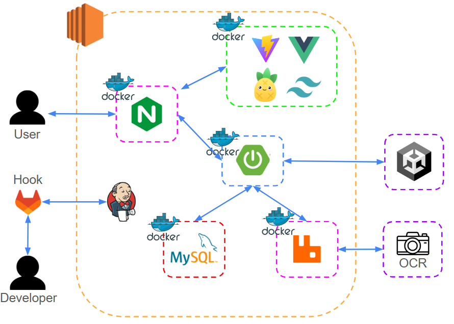
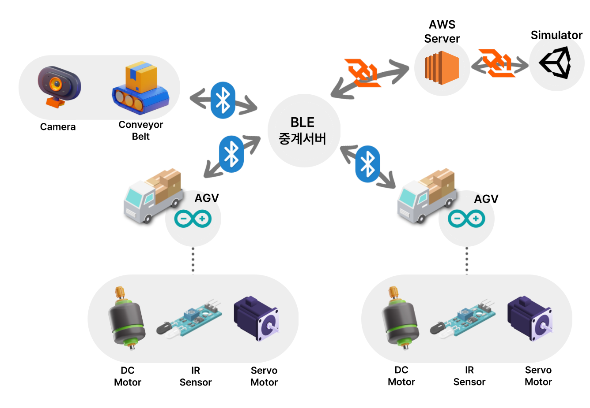
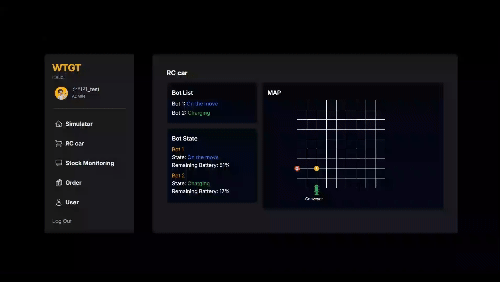
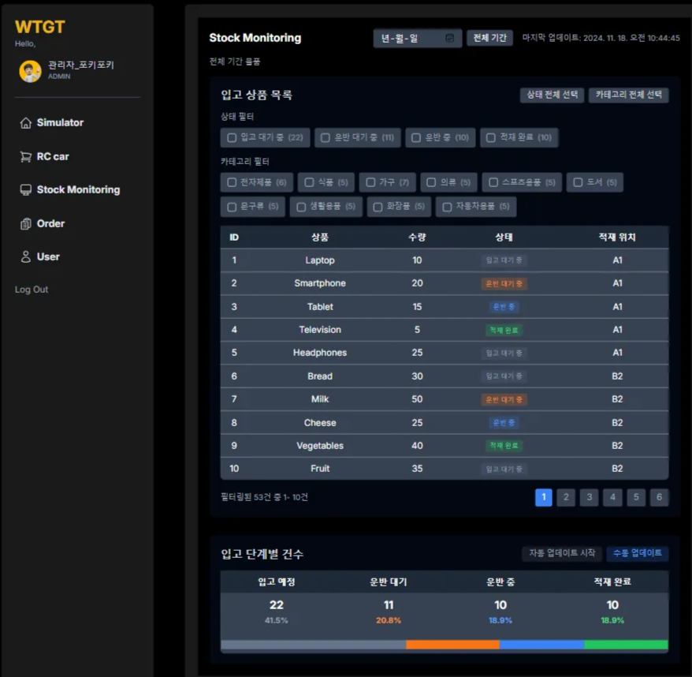
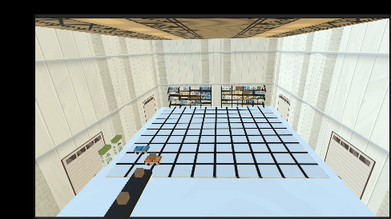

# 대신 옮겨드립니다! - 와따가따

  

 

## 프로젝트 정보

### 와따가따 / WATTAGATTA
물류 허브 적재 자동화 시스템

 

### 개발 기간: 2024년 10월 14일 ~ 2024년 11월 19일

 

## 배포 주소

서비스에 접근하려면 [여기](https://k11c208.p.ssafy.io/)를 클릭하세요

 
 

## 팀 소개

|            [김송은👑](https://github.com/sonngneee)             |             [김훈민](https://github.com/gnsals0904)              |            [이정하](https://github.com/selection-lee)            |                                                                                                               
|:------------------------------------------------------------:|:-------------------------------------------------------------:|:-------------------------------------------------------------:| 
|  |  |  |
|                        AGV 제어 및 통신 설계                        |                      주행 알고리즘 구현 및 서버 개발                       |                      인프라, 회원 인증 및 프론트엔드                       |

|[이택규](https://github.com/taekg)|[김채민](https://github.com/chaemani223)|                  [윤의웅](https://github.com/NickNmaeisntavailable)                   |                                                                                                               
|:--------------------------------------------------------:|:--------------------------------------------------------------:|:------------------------------------------------------------------------:| 
|  |  |  |
|             Unity 시뮬레이터 개발 및 BLE 서버 아키텍쳐 설계              |                        AGV 제어 및 하드웨어 설계                        |                              Vision AI, OCR                              |

 
 

## 프로젝트 설명

와따가따(WATTAGATTA)는 물품 적재시 사람이 직접 옮겨야 한다는 기존의 문제점을 해결하기 위해서 AGV 자율주행로봇으로 물품을 옮겨주는 서비스입니다.
 

## 기능 설명
- OCR 송장 인식으로 송장 정보 자동 추출
- 라인트레이싱을 이용한 AGV 자율 주행
- Unity를 활용한 디지털 트윈으로 관리자 AGV 관제 기능
- 다중 에이전트 경로 계획(MAPF)을 위한 주행 알고리즘

## 기술 스택

### 프론트 엔드

 
 

 

### 백엔드

 
 
 

### 임베디드

 

 

 

## 사용 Version
### Backend
- Java : Oracle Open JDK 17
- Spring Boot : 3.3.3
- JPA : Hibernate-core-6.5.2
- DB : MySQL

### Frontend
- Vue : 3.5.12
- Tailwind : 3.4.14
- Pinia : 2.2.4
- Axios : 1.7.7

### 협업 관리 툴

 

 

### 기타

### 웹 아키텍쳐 구조도

 
 

### HW 아키텍쳐 구조도

 
 

## 화면 구성

### RC카 관제 화면

 

### 적재 내역 화면

 

## RC카
### 완성된 RC카

### RC카 라인트레이싱 주행

 

## Unity
### 관제 화면

### ERD

